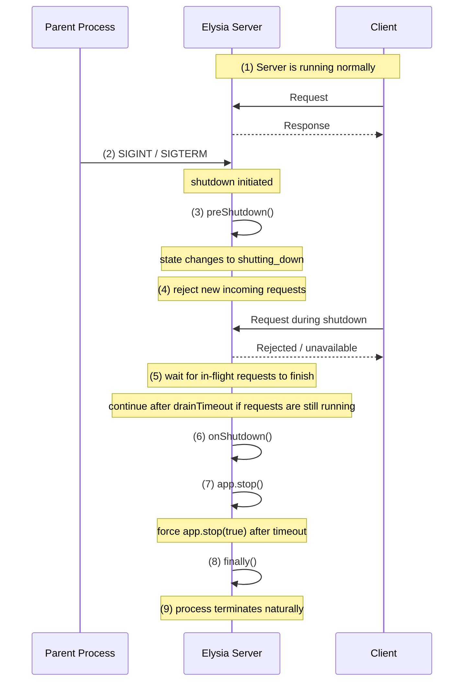

# elysia-graceful-shutdown

Graceful shutdown plugin for Elysia.

This plugin helps your Elysia app shut down in a predictable way when it receives termination signals such as SIGTERM or SIGINT.

It provides:

- signal handling
- shutdown lifecycle hooks
- in-flight request draining before cleanup

## Table of Contents

- [Installation](#installation)
- [Usage](#usage)
- [Shutdown Flow](#shutdown-flow)
- [Options](#options)
  - [`signals`](#signals)
  - [`timeout`](#timeout)
  - [`drainTimeout`](#draintimeout)
  - [`preShutdown(context)`](#preshutdowncontext)
  - [`onShutdown(context)`](#onshutdowncontext)
  - [`onError(context)`](#onerrorcontext)
  - [`finally(context)`](#finallycontext)

## Installation

```bash
bun add elysia-graceful-shutdown
```

## Usage

```typescript
import { Elysia } from 'elysia';
import { gracefulShutdown } from 'elysia-graceful-shutdown';

const app = new Elysia()
  .use(
    gracefulShutdown({
      signals: ['SIGTERM', 'SIGINT'],
      timeout: 30_000,
      drainTimeout: 10_000,
      preShutdown: ({ activeRequestCount }) => {
        console.log('shutdown begin', { activeRequestCount });
      },
      onShutdown: async ({ activeRequestCount }) => {
        console.log('all in-flight requests finished', { activeRequestCount });
        await db.destroy();
      },
      finally: async ({ signal, state, activeRequestCount }) => {
        console.log('shutdown finished', { signal, state, activeRequestCount });
      },
    }),
  )
  .get('/', () => 'hello');

app.listen(3000);
```

## Shutdown Flow



The shutdown hooks receive `activeRequestCount`, which reflects the number of
tracked in-flight HTTP requests at that phase of the shutdown flow.

For runnable demos, see `example/request-drain.ts` and `example/request-timeout.ts`.

## Options

### `signals`

Signals that trigger the shutdown flow.

Deafult:

```typescript
['SIGTERM', 'SIGINT'];
```

### `timeout`

Maximum time to allow the whole signal-driven shutdown flow to finish before
the plugin force-stops the app with `app.stop(true)`.

This is a shutdown deadline for the server lifecycle, not a guarantee that all
already-running user-land work will be interrupted.

This timeout covers:

- `preShutdown(context)`
- request draining
- `onShutdown(context)`
- `app.stop()`

Value is in milliseconds.

Default:

```typescript
30_000; // 30 seconds
```

```typescript
new Elysia().use(
  gracefulShutdown({
    timeout: 30_000,
  }),
);
```

What this option guarantees:

- the plugin stops accepting new work through the normal shutdown flow
- the plugin escalates from `app.stop()` to `app.stop(true)` when the deadline is exceeded
- active connections are force-terminated at the Bun server level

What this option does not guarantee:

- arbitrary user-land handler code is preempted immediately
- long-running async work such as `sleep()`, database calls, or external API work is cancelled automatically

On Bun, `app.stop(true)` immediately terminates active connections, but a
long-running async handler may still finish its own work after the client
connection has been closed.

### `drainTimeout`

Maximum time to wait for tracked in-flight HTTP requests to drain before the
shutdown flow continues.

This is narrower than `timeout`: `drainTimeout` only limits the request-drain
phase, while `timeout` limits the whole signal-driven shutdown path.

In other words:

- `drainTimeout` controls how long the plugin waits for tracked requests before moving on
- `timeout` controls when the plugin stops waiting for the overall shutdown lifecycle and escalates to `app.stop(true)`

Constraint:

- `drainTimeout` must be less than or equal to `timeout`
- if you omit `timeout`, the default `30_000` still applies to this rule

The plugin validates this at startup and throws if `drainTimeout` is greater
than the effective `timeout`, because otherwise the broader shutdown deadline
would expire before the request-drain budget could ever be used fully.

Value is in milliseconds.

Default:

```typescript
30_000; // 30 seconds
```

```typescript
new Elysia().use(
  gracefulShutdown({
    drainTimeout: 30_000,
  }),
);
```

### `preShutdown(context)`

Runs at the beginning of the shutdown flow.

Use this when you need to perform very early shutdown work before the plugin
waits for tracked in-flight requests to drain and before the main cleanup phase.

Examples:

- marming internal state as shutting down
- stopping schedulers
- preparing the app for shutdown
- loggin shutdown start

```typescript
new Elysia().use(
  gracefulShutdown({
    preShutdown: (context) => {
      console.log('Shutdown begin');
      console.log('Shutdown Signal: ', context.signal);
    },
  }),
);
```

### `onShutdown(context)`

Runs during the main cleanup phase, after tracked in-flight requests have
finished or after the configured `drainTimeout` has elapsed.

Use this for resource cleanup such as:

- Closing database connections
- Disconnecting Redis
- Stoping queue consumeer
- Shutting down background workers

```typescript
new Elysia().use(
  gracefulShutdown({
    onShutdown: async (context) => {
      console.log('Clean up');
      await datasource.destroy();
      await eventStore.end();
    },
  }),
);
```

### `onError(context)`

Runs when the plugin catches an error during signal-driven shutdown.

Use this to forward shutdown failures to your application's logger or
observability pipeline instead of letting the plugin write directly to stderr.

The `phase` field is one of:

- `shutdown`: a lifecycle hook failed
- `stop`: `app.stop()` failed
- `timeout`: the overall shutdown deadline elapsed and the plugin escalated to `app.stop(true)`

For `phase: 'timeout'`, this means the plugin hit the server shutdown deadline.
It does not necessarily mean every already-running handler was synchronously
aborted in user land.

```typescript
new Elysia().use(
  gracefulShutdown({
    onError: ({ phase, error, signal }) => {
      logger.error('graceful shutdown failed', {
        phase,
        signal,
        error,
      });
    },
  }),
);
```

### `finally(context)`

Runs at the end of the shutdown flow.

Use this for short final work such as:

- final logging
- metrics markers
- lightweight finalization

```typescript
new Elysia().use(
  gracefulShutdown({
    finally: async ({ signal, state }) => {
      console.log('Shutdown finished');
      console.log('Shutdown state: ', state);
      console.log('Shutdown Signal: ', signal);
    },
  }),
);
```
