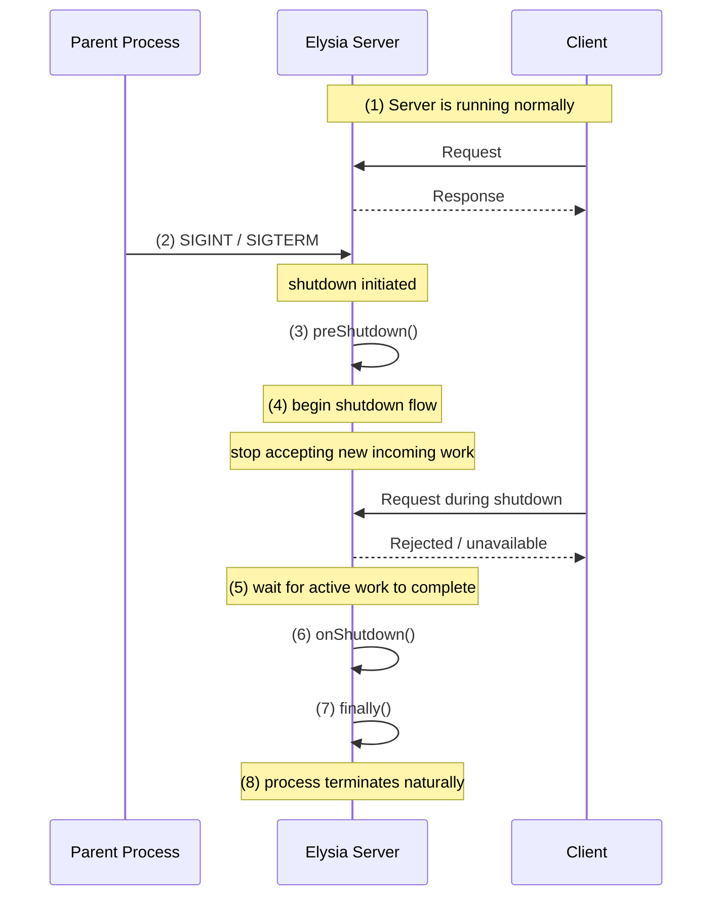

# elysia-graceful-shutdown

Graceful shutdown plugin for Elysia.

This plugin helps your Elysia app shut down in a predictable way when it receives termination signals such as SIGTERM or SIGINT.

It provides:

- signal handling
- shutdown lifecycle hooks
- timeout-based shutdown flow

## Table of Contents

- [Installation](#installation)
- [Usage](#usage)
- [Shutdown Flow](#shutdown-flow)
- [Options](#options)
  - [`signals`](#signals)
  - [`timeout`](#timeout)
  - [`preShutdown(context)`](#preshutdowncontext)
  - [`onShutdown(context)`](#onshutdowncontext)
  - [`onError(context)`](#onerrorcontext)
  - [`finally(context)`](#finallycontext)

## Installation

```bash
bun add elysia-graceful-shutdown
```

## Usage

```typescript
import { Elysia } from 'elysia';
import { gracefulShutdown } from 'elysia-graceful-shutdown';

const app = new Elysia()
  .use(
    gracefulShutdown({
      signals: ['SIGTERM', 'SIGINT'],
      timeout: 30_000,
      preShutdown: () => {
        console.log('shutdown begin');
      },
      onShutdown: async () => {
        await db.destroy();
      },
      finally: async ({ timedOut, signal }) => {
        console.log('shutdown finished', { timedOut, signal });
      },
    }),
  )
  .get('/', () => 'hello');

app.listen(3000);
```

## Shutdown Flow



## Options

### `signals`

Signals that trigger the shutdown flow.

Deafult:

```typescript
['SIGTERM', 'SIGINT'];
```

### `timeout`

Maximum time to wait for tracked in-flight work to drain, in milliseconds.

This timeout only applies to the active request/work draining step.

If the timeout is reached:

- `timedOut` becomes `true`
- the plugin stops waiting for active work to finish
- `onShutdown(context)` and `finally(context)` still run

Default:

```typescript
30_000; // 30 seconds
```

### `preShutdown(context)`

Runs at the beginning of the shutdown flow.

Use this when you need to perform very early shutdown work before the main cleanup phase.

Examples:

- marming internal state as shutting down
- stopping schedulers
- preparing the app for connection draining
- loggin shutdown start

```typescript
new Elysia().use(
  gracefulShutdown({
    preShutdown: (context) => {
      console.log('Shutdown begin');
      console.log('Shutdown Signal: ', context.signal);
    },
  }),
);
```

### `onShutdown(context)`

Runs during the main cleanup phase.

Use this for resource cleanup such as:

- Closing database connections
- Disconnecting Redis
- Stoping queue consumeer
- Shutting down background workers

```typescript
new Elysia().use(
  gracefulShutdown({
    onShutdown: async (context) => {
      console.log('Clean up');
      await datasource.destroy();
      await eventStore.end();
    },
  }),
);
```

### `onError(context)`

Runs when the plugin catches an error during signal-driven shutdown.

Use this to forward shutdown failures to your application's logger or
observability pipeline instead of letting the plugin write directly to stderr.

```typescript
new Elysia().use(
  gracefulShutdown({
    onError: ({ phase, error, signal }) => {
      logger.error('graceful shutdown failed', {
        phase,
        signal,
        error,
      });
    },
  }),
);
```

### `finally(context)`

Runs at the end of the shutdown flow.

Use this for short final work such as:

- final logging
- metrics markers
- lightweight finalization

This hook may run whether shutdown completed normally or timed out.

```typescript
new Elysia().use(
  gracefulShutdown({
    finally: async ({ timedOut, signal }) => {
      console.log('Shutdown finished');
      console.log('Shutdown timed out: ', timedOut);
      console.log('Shutdown Signal: ', signal);
    },
  }),
);
```
